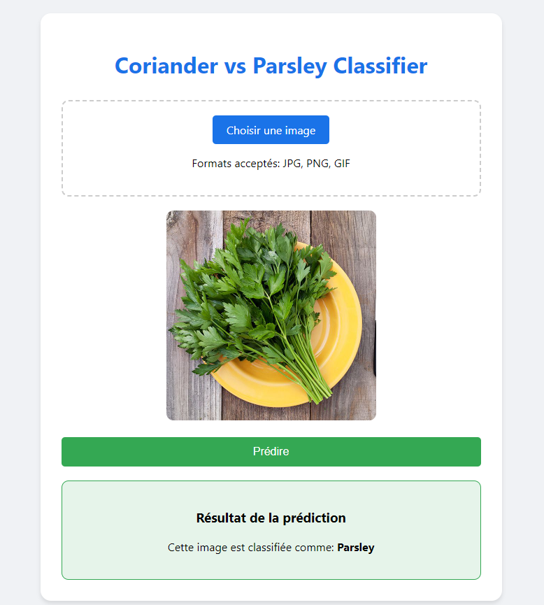

# 🌿 Coriander vs Parsley Classifier Web Template

This repository contains a **web template** designed as a user-friendly front-end interface for interacting with the [Coriander vs Parsley Classifier API](https://github.com/echarif/coriander_vs_parsley_api.git). It enables users to upload images and view classification results seamlessly through a modern, responsive design.

## 🚀 Features

- **Simple and Intuitive UI**: Easily upload images and view prediction results.
- **Responsive Design**: Works on both desktop and mobile devices.
- **Direct API Integration**: Connects with the Coriander vs Parsley API for real-time predictions.
- **Error Handling**: Displays user-friendly messages for invalid images or server issues.

## 📋 How It Works

1. Users select an image file from their device.
2. The image is previewed in the browser.
3. Upon clicking the "Predict" button, the image is sent to the API.
4. The predicted result is displayed on the page.

## 🛠️ Setup Instructions

### Local Usage

1. **Clone the repository**:
   ```bash
   git clone <repository_url>
   cd <repository_name>
   ```

2. Open the `index.html` file in any modern web browser:
   - On most systems, you can double-click the file or drag it into a browser window.

3. Make sure the [API repository](https://github.com/your-username/coriander-vs-parsley-classifier-api) is deployed and accessible at the specified URL.

### API Configuration

This template is pre-configured to connect to the API deployed at:
```
https://coriander-vs-parsley-api.onrender.com
```
If the API is deployed elsewhere, update the fetch URL in the `<script>` section of `index.html`:
```javascript
const response = await fetch('https://your-new-api-url/predict/', { ... });
```

## 🌐 Integration with the API

This web template serves as the front-end for the **Coriander vs Parsley Classifier API**, which is available in the repository below:
- [Coriander vs Parsley Classifier API Repository](https://github.com/echarif/coriander_vs_parsley_api.git)

The API handles the actual classification logic and returns predictions to this front-end.

## 🎨 Preview

Below is a preview of the **Coriander vs Parsley Classifier Template**:



> **Note**: Replace `path/to/your/image.png` with the actual file path of the preview image in the repository.

## 🧑‍💻 Contributions

Feel free to fork this repository, enhance the UI, or adapt it for other classification tasks. Contributions and feedback are welcome!
